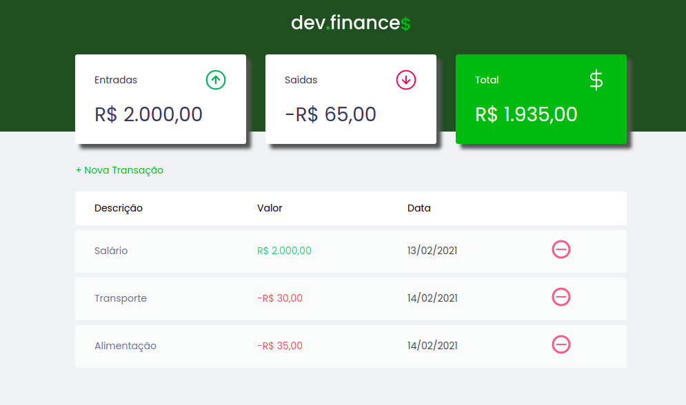

<h1 align="center">Maratona Discover</h1>

<h1 align="center">
    
</h1>

    
    

Maratona Discover is an event by Rocketseat focused on Frontend development to train skills with HTML, CSS and Javascript

## 🛠️ Technologies

This project was developed with the following technologies:

 - HTML 
 - CSS
 - JavaScript

## 💻️ Demo

You can access the project page through [this link](https://maratona-discover.netlify.app).

## 📝️ License

This project is under the MIT license. Check the [LICENSE](LICENSE) file for more details.